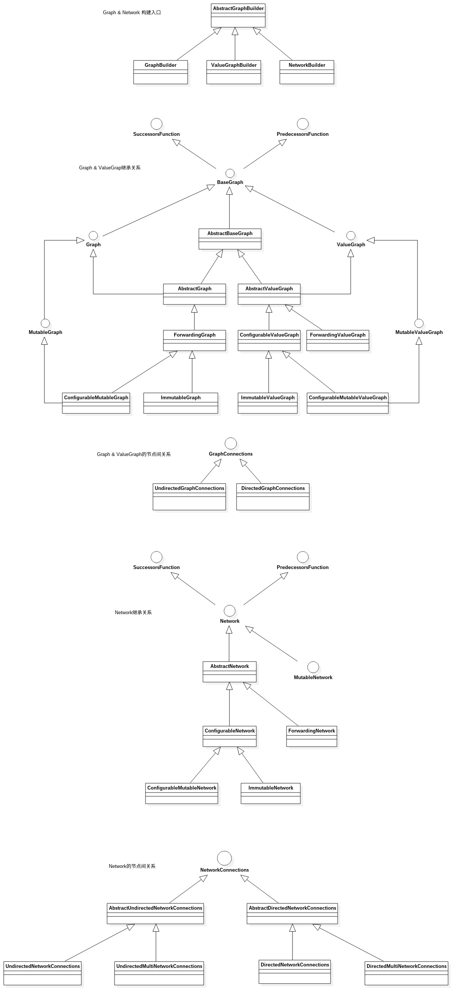

# graph 图论
`Guava`库的目录`common.graph`包含的模块是一个描述实体(`entity`)以及实体之间的关系的图数据结构模型库。例如：网页与超链接、科学家与他们写的论文、机场与其航线、人与其家族等。`Guava-Graph`模块的目的是提供一种通用以及可扩展的语言来描述类似上述的举例。

## 关系图



## 定义
- **`graph` 的组成**，图中每一条边都是**有向**边的，则被称为**有向图**；每一条边都是**无向**的，则被称为**无向图**。**不支持图中既有有向边又有无向边的情形**。
	- **`node` 节点**：一组节点(`node`)（也称为**顶点**）
	- **`edge` 边**：一组连接节点的边(`edge`)（也称为**链接**或者**弧**）
	- **`endpoint` 端点**：边缘的节点称为端点(`endpoint`)
	- **`directed` 有向边**: 定义了开始(`source`)和结束(`target`)，有向边适用于非对称的关系模型（起源、指向、作者）
	- **`undirected` 无向边**: 没有定义了开始(`source`)或结束(`target`)，无向边适用于对称关系模型（折叠、距离、同级关系）
	- **`source` 起点**: 边的起始点，用来连接边
	- **`target` 终点**: 边的结束点，用来连接边

**示例**：	
```java
graph.addEdge(nodeU, nodeV, edgeUV);
```
`nodeU`和`nodeV`是两个邻接点(`adjacent`)，`edgeUV`是顶点`nodeU`到顶点`nodeV`的事件(`incident`)
	
在**有向图**中，有如下定义：
+ `nodeU`是`nodeV`的一个**前趋**(`predecessor`)
+ `nodeV`是`nodeU`的一个**后继**(`successor`)
+ `edgeUV`是`nodeU`的一条**出度**(`outgoing`)边
+ `edgeUV`是`nodeV`的一条**入度**(`incoming`)边
+ `nodeU`是边`edgeUV`的**起点**(`source`)
+ `nodeV`是边`edgeUV`的**终点**(`target`)

在**无向图**中，有如下定义：
+ `nodeU`既是`nodeV`的**前趋**也是`nodeV`的**后继**
+ `nodeV`既是`nodeU`的**前趋**也是`nodeU`的**后继**
+ `edgeUV`既是`nodeU`的**入度**也是`nodeU`的**出度**
+ `edgeUV`既是`nodeV`的**入度**也是`nodeV`的**出度**

一条连接节点本身的边被称为**自环**(`self-loop`)，也就是说，**一条边连接了两个相同的节点**。如果这个自环是**有向**的，那么这条边既是节点的**入度边**也是节点的**出度边**，这个节点既是边的**起点**(`source`)也是边的**终点**(`target`)。

如果两条边以**相同的顺序**连接**相同**的节点，则称这两条边为**平行边**(`parallel`)。如果以**相反的顺序**连接相同的节点则称这两条边为**逆平行边**(`antiparallel`)，**无向边**不能被称为**逆平行边**。

示例：
```java
//有向图
directedGraph.addEdge(nodeU, nodeV, edgeUV_a);
directedGraph.addEdge(nodeU, nodeV, edgeUV_b);
directedGraph.addEdge(nodeV, nodeU, edgeVU);

//无向图
undirectedGraph.addEdge(nodeU, nodeV, edgeUV_a);
undirectedGraph.addEdge(nodeU, nodeV, edgeUV_b);
undirectedGraph.addEdge(nodeV, nodeU, edgeVU);
```
在**有向图**`directedGraph`中，边`edgeUV_a`和边`edgeUV_b`是**相互平行边**，与边`edgeVU`是**逆平行边**；在**无向图**`undirectedGraph`中，边`edgeUV_a`、`edgeUV_b`和`edgeVU`是**两两相互逆平行边**。

## 功能
`common.graph`模块的核心是提供**图相关操作的接口和类**。另外，它**没有提供类似`I/O`或者可视化**的功能。如果选用这个模块将会有非常多的限制，具体详细信息可以查看下面`FAQ`的相关主题。

总体来讲，它提供了如下几种类型的图：
+ 有向图
+ 无向图
+ 节点和（或）边带权图
+ 允许（不允许）自环图
+ 允许（不允许）平行边图，允许平行边图有时也称为**多重图**(`multigraphs`)
+ 节点或边被有序插入、顺序、无序图(`graphs whose nodes/edges are insertion-ordered, sorted, or unordered`)

`common.graph`中的各种类型的图都是通过与其相关的`Builder`具体实现类型来构建的，不过这些`Builder`实现类型**不一定支持**上面提到的所有图类型，但也可能支持其他类型的图。库中图的数据结构是通过矩阵、邻接`list`或邻接`map`等方式来存储的，选择何种存储方式取决于适用的实现场景。

对于以下这些变形图在`common.graph`中没有确切的支持，尽管它们可以通过已有的图类型进行建模：
+ 树(`trees`)、森林(`forests`)
+ 由不同类型的同类元素（节点或边）构成的图。（二分图/k分图、`multimodal graphs`）
+ 超图

`common.graph`**不允许图中同时存在**有向边和无向边。`Graphs`中提供了很多基本操作（如：图的拷贝和比较操作）。


## 图的类型
`common.graph`模块中有三种通过边来作为区分依据的"`top-level`"接口(`interface`)：`Graph`、 `ValueGraph`和`Network`。另外还存在一些同级类型，不过这些都不是这三种类型的子类型。

上面三种 "`top-level`" 接口都继承自接口`SuccessorsFunction`和`PredecessorsFunction`。这样做是为了在仅需要访问节点的**后继**（`successors`）或者**前趋**（`predecessors`）的图中，它可以直接被用来作为**图算法**（例如，`BFS`广度优遍历）中参数的类型。这在图形的所有者已经具有适用于它们的表示并且不特别想要将它们的表示序列化为`common.graph`类型以便运行一个图算法的情况下尤其有用。

### `Graph`
`Graph`是最简单也是最基本的图类型。为了**处理节点与节点之间的关系**它定义了一些基本的操作，例如：`successors(node)` --> 获取`node`的后继`adjacentNodes(node)` --> 获取`node`的邻接点`inDegree(node)` --> 获取`node`的入度等。这些节点在图中都是**唯一**的对象，在其内部数据结构中，你可以认为它们是**`Map`的键值(`Key`)**。

`Graph`中的边是完全匿名的，他们只能根据端点来定义。举例：`Graph<Airport>`中，其边连接任意两个可以直航的机场。

### `ValueGraph`
接口`ValueGraph`包含了`Graph`中的所有与节点相关的方法，并增加了一些**检索指定边权值**的方法。

`ValueGraph`中的每一条边都有一个与之相关的特定权值，但是这些权值不能保证唯一性。`ValueGraph`与`Graph`的关系类似与`Map`与`Set`的关系（`Graph`中的边是以顶点对的形式保存在`Set`中，而`ValueGraph`的边是以顶点对与其权值的映射关系保存在`Map`中）。

`ValueGraph`提供了一个`asGraph()`的函数，它可以从`ValueGraph`中返回一个`Graph`视图，这样作用于`Graph`实例上的方法也能作用于`ValueGraph`的实例上。

举例：`ValueGraph<Airport, Integer>`，其边表示在能直航的两个机场之间航班必须花费的时间。

### `Network`
`Network`中包含了`Graph`中的所有与节点相关的方法，还增加了**操作边以及操作顶点与边的关系**的方法，例如：`outEdges(node)` --> 获取`node`的出度边 ` incidentNodes(edge)` --> 获取边`edge`的顶点对和 `edgesConnecting(nodeU, nodeV)` --> 获取`nodeU`和`nodeV`的直连边。
`Network`中每一条边都是唯一的，就像节点在所有的`Graph`类型中是唯一的一样。边的唯一性限制使得`Network`能够天然的支持**并行边**，以及与**边和节点与边相关**的方法。

`Network`类提供了一个`asGraph()`的方法，它可以从`Network`中返回一个`Graph`视图，这样作用于`Graph`实例上的方法也能操作`Network`的实例上。

举例：`Network<Airport, Flight>` 它的每一条边代表了从一个机场到另一个机场可以乘坐的特定航班（两个机场之间可以同时有多趟航班）。

## 如何选择合适的图类型
这三种图类型之间本质的**区别在于它们边表示的不同**：

+ `Graph`中的边是节点之间的**匿名连接**，**没有自己的标识或属性**。如果每一对节点之间都是通过最多一条边连接的，而且这些边没有任何与之相关的信息时，则选用它。
+ `ValueGraph`中的边带有一个值（例如权值或标签），且边**在整个图中不能保证其唯一性**。如果每一对节点之间都是通过最多一条边连接的，并且每一条边都有与之相关的权值时，则选用它。
+ `Network`中边是**全局唯一**的，就像**节点在图中是唯一**的一样。如果边对象需要唯一，并且希望能查询它们的引用时，则选用它。(请注意，这种唯一性使得`Network`支持平行边。)

## 构建图的实例

`common.graph`中图的具体实现类并没有设计成`public`的，这样主要是为了减少用户需要了解的图类型的数量，使得构建各种功能的图变得更加容易。要创建一个**内置图类型**的实例，可以使用相应的`Builder`类： `GraphBuilder`、` ValueGraphBuilder`和`NetworkBuilder`。例如：
```java
MutableGraph<Integer> graph = GraphBuilder.undirected().build();

MutableValueGraph<City, Distance> roads = ValueGraphBuilder.directed().build();

MutableNetwork<Webpage, Link> webSnapshot = NetworkBuilder.directed()
    .allowsParallelEdges(true)
    .nodeOrder(ElementOrder.natural())
    .expectedNodeCount(100000)
    .expectedEdgeCount(1000000)
    .build();
```
- 可以使用下面两种的任意一种方式通过`Builder`来构建图实例：
	+ 1、调用静态方法`directed()` 或者 `undirected()` 来实例化一个**有向图或者无向图**。
	+ 2、调用静态方法`from()`基于一个**已存在**的图实例构建图。
- 在创建了`Builder`实例后，还可以**选择**指定其他特性和功能。
- 同一个`Builder`实例可以**多次调用`build()`方法来创建多个图**的实例。
- 不需要在`Builder`上指定**节点和边**的类型，只需要在**图类型本身**上指定即可。
- `build()`方法返回一个`Mutable`子类型的图时，提供了**变形**的方法。下面将会介绍更多关于`Mutable`和`Immutable`的图。

## 构建器约束与优化提示
`Builder`类型通常提供两种类型的选项：**约束**和**优化提示**。

约束指定由给定`Builder`实例创建的图**必须满足的行为和属性**，例如：
+ **图表**是否有针对性。
+ 该图是否允许**自循环**。
+ 是否对此图的**边进行排序**。

优化提示可以可选地由实现类使用以**提高效率**，例如，确定内部数据结构的类型或初始大小。它们不能保证有任何效果。

每种图表类型都提供与其`Builder`指定的约束相对应的访问器，但不提供优化提示的访问器。

## 可变(`Mutable`)图和不可变(`Immutable`)图

### `Mutablexx` 类型
每种图类型都有与其对应的`Mutablexx`子类型： `MutableGraph`，`MutableValueGraph`，以及 `MutableNetwork`。这些子类型定义了下面这些变形方法：

+ 增加和删除节点的方法：`addNode(node)`、`removeNode(node)`。
+ 增加和删除边的方法：
	```java
	MutableGraph --> putEdge(nodeU, nodeV)、removeEdge(nodeU, nodeV)
	MutableValueGraph --> putEdgeValue(nodeU, nodeV, value)、removeEdge(nodeU, nodeV)
	MutableNetwork --> addEdge(nodeU, nodeV, edge)、removeEdge(edge)
	```
这些方法的定义与`java`的集合类型以及`guava`的新集合类型都有所不同 —— 每种类型都包含**变形方法**的函数签名。选择将变形方法放在子类型中，一部分原因是为了鼓励防御性编程：一般来说，如果你的代码只是为了检查或者遍历一个图，而不改变它，那么输入应该就指定为`Graph`、`ValueGraph`或者 `Network`类型，而不是它们的可变子类型。另一方面，如果你的代码确实需要修改一个对象，那么使用带`Mutable`修饰的子类对你会很有帮助。

由于`Grpah`等都是接口，即使它们不包含这些变形方法，但这些接口的实例并不能保证这些方法不被调用（如果它们实际上是`Mutablexx`的子类型），因为调用者可能会将其转换成该子类型。如果有一种**契约的保证**，即一个方法的参数或返回值不能被修改的`Grahp`类型，你可以使用下面介绍的这种不可变(`Immutable`)实现。

### `Immutablexx` 的实现
每一种图类型(`Graph`、`ValueGraph`、`Network`)都有相应的不可变实现类(`ImmutableGraph`、`ImmutableValueGraph`、`ImmutableNetwork`)，这些类类似于`Guava`的`ImmutableSet`、`ImmutableList`、`ImmutableMap`等，一旦被创建出来，它们就不能被修改，且它们在内部使用了高效的不可变数据结构。

不同与Guava的其他不可变类型，这些不可变实现类压根没有提供修改的方法，所以他们不需要抛出`UnsupportedOperationException`异常来应对这些操作。

通过调用静态方法`copyOf()`来创建`ImmutableGraph`等的实例。例如：
```java
ImmutableGraph<Integer> immutableGraph = ImmutableGraph.copyOf(graph);
```
